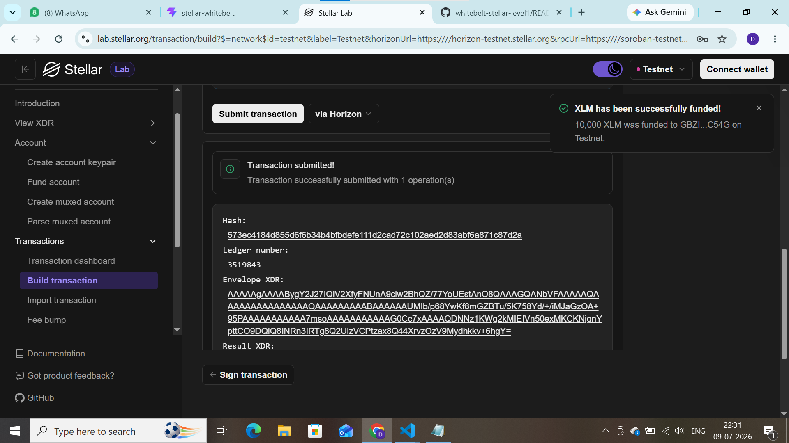

# Stellar WhiteBelt - Level 1 dApp

A simple Stellar payment dApp built for the Level 1 White Belt challenge in the Stellar Journey to Mastery program. It connects to the Freighter wallet, displays the connected wallet's XLM balance, and lets the user send a testnet XLM payment to any address.

## Features

- Connect / disconnect Freighter wallet
- Fetch and display connected wallet's XLM balance
- Send 1 XLM to any Stellar Testnet address
- Success and failure feedback for transactions (with error handling)

## Tech Stack

- HTML, CSS, JavaScript (no build step)
- [@stellar/stellar-sdk](https://www.npmjs.com/package/@stellar/stellar-sdk)
- [@stellar/freighter-api](https://www.npmjs.com/package/@stellar/freighter-api)
- Stellar Testnet

## Setup Instructions (Run Locally)

1. Clone this repository:
2. git clone https://github.com/Deepika8500/whitebelt-stellar-level1.git
3.  Open the folder and open `index.html` directly in your browser
(or serve it with a simple local server, e.g. `npx serve .`)
4. Install the [Freighter Wallet browser extension](https://www.freighter.app/)
5. In Freighter, switch the network to **Testnet**
6. Fund your Testnet wallet using the [Stellar Testnet Friendbot](https://laboratory.stellar.org/#account-creator?network=test)
7. Open the app in your browser, click **Connect Freighter**, approve the connection

## How to Use

1. Click **Connect Freighter** and approve the connection request
2. Your wallet address and XLM balance will be displayed
3. Enter a receiver's Testnet address in the input field
4. Click **Send 1 XLM** and approve the transaction signing in Freighter
5. The transaction result (success with hash, or failure message) will be shown

## Screenshots

### Wallet Connected State

### Balance Displayed

### Successful Testnet Transaction & Result

## Notes

This project uses the Stellar Testnet only — no real funds are involved.
